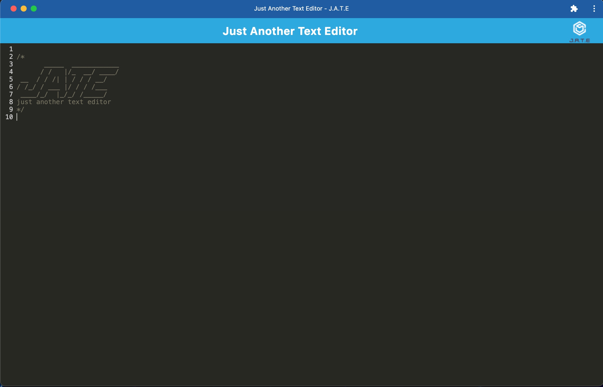

# JATE SUPER TEXT EDITOR
# Progressive Web Applications (PWA): Text Editor

## Table of Contents

- [Installation](#installation)
- [Usage](#usage)
- [Contributing](#contributing)
- [Tests](#tests)
- [Credits](#credits)
- [Licenses](#licenses)
- [Questions](#questions)

## Description
JATE stands for Just Another Text Editor.
The purpose of the creation of JATE is to show off ability to create PWA or progressive web applications.
This is an app that you can install on your device and even use it offline.
You can add text to the interface and when you leave and return to it your latest text will be saved and appear in the input area.

## LINK TO DEPLOYED APP 
https://supertexteditor-jate-47a351fbbe2f.herokuapp.com

## Tools
Packages like babel, indexDb, concurrently, express, if-env, code-mirror-themes, webpack, and etc... where used to create this app. (to see the full list just clone the project and look inside the package.json files)
Javascript was the language used to code this app.

## Usage
You can use this app to create notes/code snippets and have them saved and retrieved with or without an internet connection.

## Installation
You can clone this project from my github repo linked below.
https://github.com/WillZealot/Jate_Editor
Once you have it cloned run `npm i` in the terminal and inside of the client folder to download all dependencies. You can then run `npm run start` in the terminal to build/compile the app and start the server. You can then view it at localhost:3000

## Credits
William Tikhonenko aka WillZealot

## Contributing
N/A

## Tests
None

## Licenses

## Questions
https://github.com/WillZealot
williamtikhonenko@gmail.com
